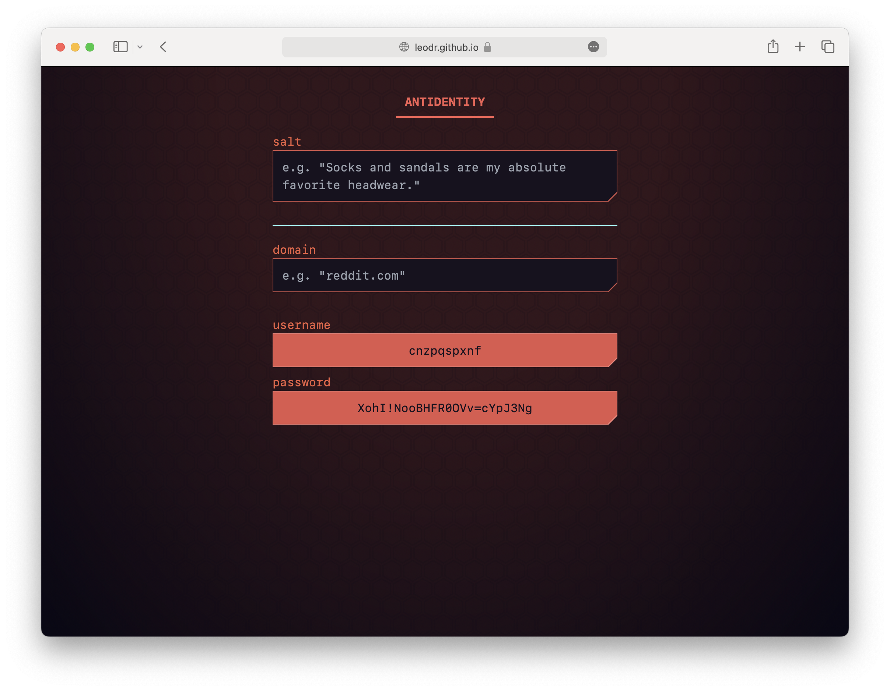

  

<h1 align="center">Antidentity</h1>

  <b>
    Stateless account manager that works only with a keyphrase. 
  </b>

  

Antidentity is sort of a password manager that works without storage or syncing.
It generates unique usernames and passwords by hashing a keyphrase with the
domain name of the service you want to use.

It runs entirely in your browser and is contained within the single `index.html`
file, which can be run locally or hosted yourself.

 

## Screenshot

